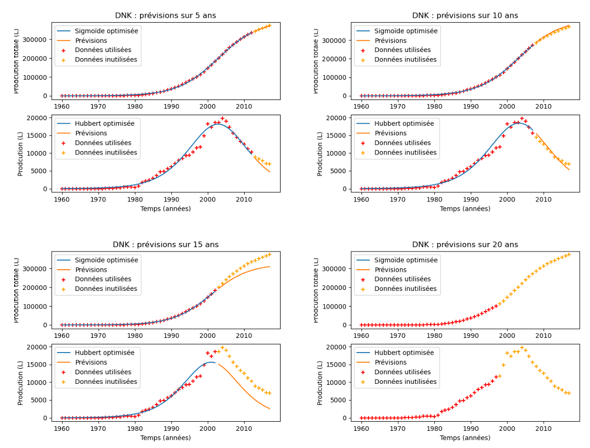

# Modeling of Oil Production
In this project, we optimized Hubert curves on oil production datasets. We were able to make accurate predictions when using partial datasets (as shown above on the dataset of Danemark's oil production).

For detailed documentation, refer to the [full report](RAPPORT_YoanTHOMAS_AyaKROUSSA_MelvinCERBA.pdf).